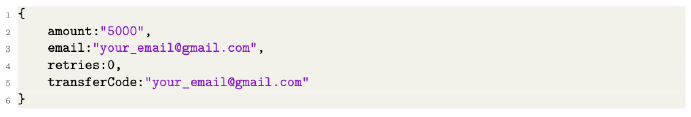
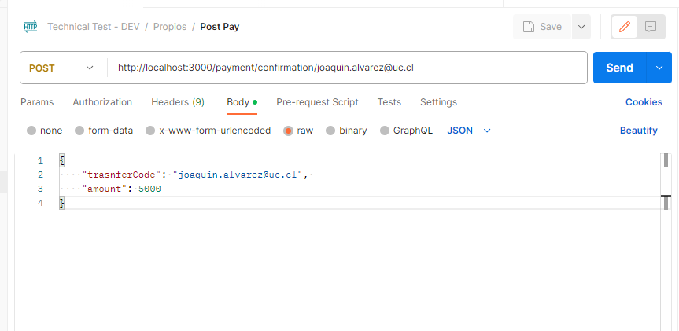

# Readme
## General

The aplication was created in ubuntu 20.04 and containerized with docker, for this reason the requirements are the following.

Requirements: 
- Docker
- Ubuntu

The use Typescript/Javascrip and Sequelize as ORM, and the db is made in postgres.

## Environment Variables

In the file .env can you find multiple variables, but the only important ones are NODE_ENV, ENV and maybe AUTH_TOKEN. The first define the environment of the db, can be 'development', 'test', or 'production'. The second one is very importan because define if we use dev or prod enviroment in our app, only this options, if we use other, the links wont work, the last one is the auth token, this must go in any request to the app. 

## Build and run

In ubuntu, to run the app, first you need build of this with the command in the root:

> docker compose build

After this you can up the app with:

> docker compose up 

After this, we can load the seeds if we want, with the command

>docker exec -it technicalTestCurrencyBird npx sequelize-cli db:seed:all

in other terminal if the app not run in demon mod. Its charge only one seed in the db in use (dev, test or production).

## About app

All important code is in Api/src. 

- controllers: contain test controller and the real, test isnt importan, i used it for test functions only.

- routes: contain the logic behind the rout and paths that i use. In this have test path and pyment paths.

- utils: functions that i use in multiple parts, and for order, i grouped in utils.ts, the file rules contains the CORS and authentication rules.  

- server.ts is the main of the app

I use WEB API LOCK to ensure the integrity of the transactions, this can be seen in the controllers.

## Endpoints

We have two endpoints. (Remember the authcode can be change if you want)

| |  |
| --- | --- |
|Description | Is for obtain the information of a transaction
|URL | http://localhost:3000/payment/information/:transferCode |
|Header | Authorization: currencyBirdAuthToken |
| Method | GET |
- Respuesta exitosa:

| |  |
| --- | --- |
|Description | Is for make a transaction
|URL | http://localhost:3000/payment/confirmation/:transferCode |
|Header | Authorization: currencyBirdAuthToken |
| Method | POST |
| Body | { "transferCode": trasnfercode, "amount": 1000 }
- Respuesta exitosa:

If you use postman use raw an JSON for send the body, because th app only accept 'application/json' in the Content-Type.

 

The error were handled, 401 can be bad token or bad email in path or body (transfercode), if you try use the same transfercode more than once, the error is 400 with a descriptive message. The rest of error show the same status and message that we received from the api.